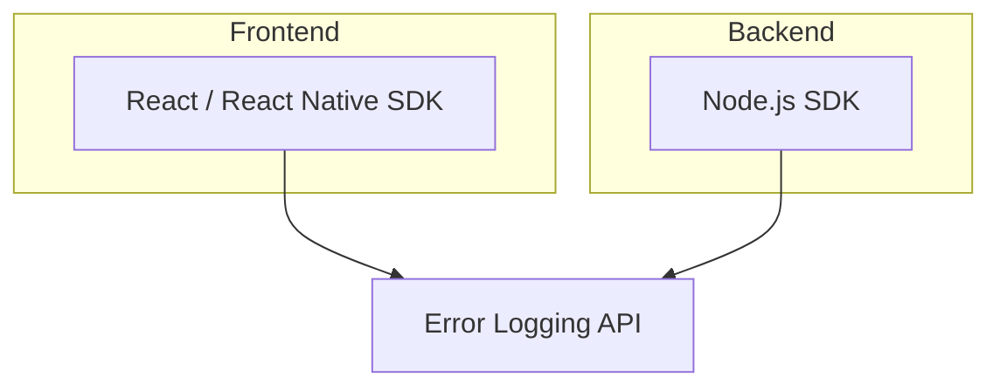
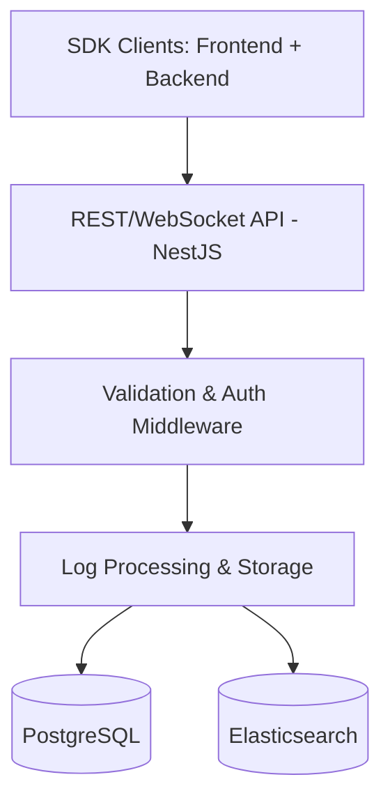
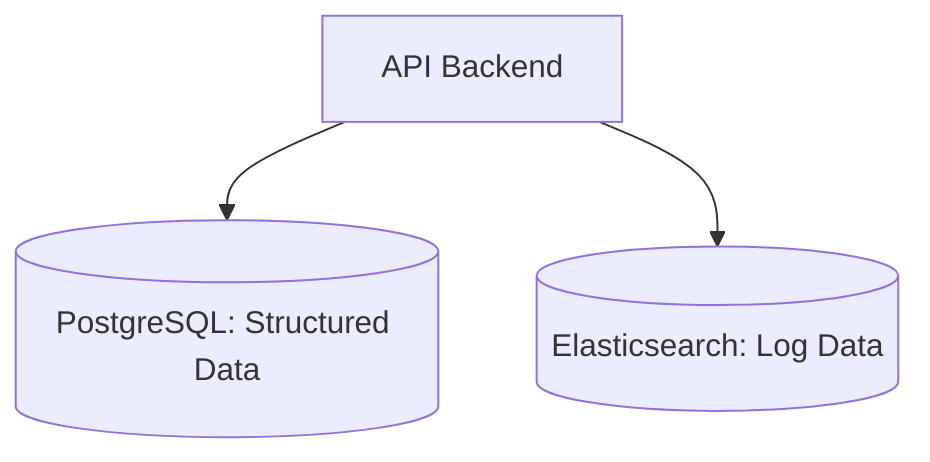
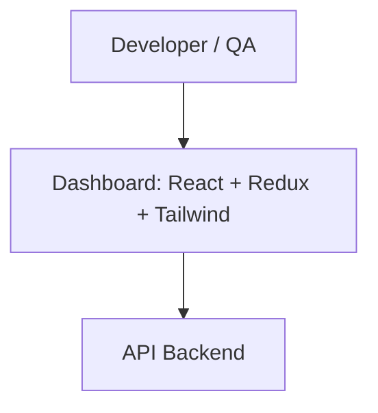

# Error Logging Service Architecture

## Overview

An error logging service captures and records application errors, provides real-time alerts, and offers a dashboard for analysis.
---

## Architecture Breakdown

### **1. Client SDK**

**Technology:** Node.js / JavaScript / TypeScript with React and React Native

**Justification:**

* **Cross-Platform Compatibility:** One unified SDK can capture logs from web applications (React), mobile applications (React Native), and backend services (Node.js). This reduces the complexity of maintaining separate SDKs for each environment.
* **Backend & Frontend Coverage:** The SDK integrates with browser error handlers, React error boundaries, and unhandled promise rejections, as well as with Node.js servers to capture exceptions, request/response errors, and unhandled exceptions.
* **Web Integration:** Compatible with modern JS frameworks like Angular, Vue, and Next.js.
* **Unified Codebase:** One codebase for all supported environments improves maintainability and feature parity.
* **Type Safety:** TypeScript provides compile-time type checking and better tooling support.
* **Performance:** Lightweight, asynchronous log transmission with batching to reduce overhead.
* **Security:** Optional encryption of log payloads before transmission.

**Diagram:**

---

### **2. API Backend**

**Technology:** Node.js with NestJS framework

**Justification:**

* **Unified Language Stack:** Node.js shares the same language as the SDK.
* **Scalable & Modular:** NestJS enforces a clean, modular architecture.
* **Non-blocking I/O:** Handles high-throughput log ingestion efficiently.
* **Middleware Support:** Integrates authentication, rate-limiting, and validation easily.
* **WebSocket Ready:** Integrates with Socket.io for real-time updates to the dashboard.

**Responsibilities:**

* Ingest logs from SDK clients.
* Validate and authenticate incoming data.
* Enrich logs with metadata.
* Store structured data in PostgreSQL.
* Store logs in Elasticsearch for fast querying.
* Trigger alert workflows for critical errors.

**Diagram:**

---

### **3. Database Layer**

**Primary Storage:** PostgreSQL
**Secondary Storage:** Elasticsearch

**PostgreSQL Benefits:**

* ACID-compliant, ideal for user data, configuration, and metadata.
* Supports JSONB for semi-structured data.

**Elasticsearch Benefits:**

* Optimized for log indexing and full-text search.
* Real-time indexing for low-latency queries.
* ILM for automated retention and archival.

**Integration Benefits:**

* Separate structured and unstructured data stores.
* Independent scaling of each layer.

**Diagram:**

---

### **4. Web Dashboard**

**Frontend:** React (TypeScript), Redux Toolkit, Tailwind CSS

**Justification:**

* **React:** Efficient, component-driven UI framework ideal for highly interactive dashboards.
* **TypeScript:** Enforces type safety and improves maintainability.
* **Redux Toolkit:** Centralized state management with simplified patterns for predictable data flow.
* **Tailwind CSS:** Utility-first CSS framework for rapid development and consistent styling.

**Core Capabilities:**

* **Real-time Log Updates:** Leverages WebSockets to instantly reflect incoming errors.
* **Advanced Filtering & Search:** Multi-criteria filtering, full-text search, and date-range queries powered by Elasticsearch.
* **Error Grouping & Trends:** Groups related errors and visualizes frequency over time.
* **Detailed Error Context:** Displays stack traces, user/session info, and associated metadata.
* **Role-based Access Control:** Restricts data visibility and actions based on user roles.
* **Customizable Views:** Allows users to save search filters and preferred layouts.
* **Responsive Design:** Mobile-friendly UI for monitoring on the go.

**Performance Optimizations:**

* **Virtualized Tables:** Efficiently render thousands of log entries.
* **Lazy Loading & Code Splitting:** Reduce initial load times.
* **Memoization:** Prevent unnecessary re-renders for stable UI components.

**Diagram:**

---

### **5. Real-time Alerts**

**Technologies:** WebSocket via Socket.io, Email via SendGrid or AWS SES

**Justification:**

* WebSocket for instant updates.
* Email for critical incidents.

**Maintenance Costs:**

* **SendGrid:** \~\$19.95/month for 50,000 emails. Easy setup, high deliverability.
* **AWS SES:** \~\$0.10 per 1,000 emails. Cost-effective at scale, more setup required.

> **Recommendation:** SendGrid for ease, AWS SES for cost-efficiency at scale.

---

### **6. DevOps & Infrastructure**

**Cloud:** AWS
**Containerization:** Docker
**Orchestration:** Kubernetes (EKS)
**Monitoring:** Prometheus & Grafana
**CI/CD:** GitHub Actions / GitLab CI/CD

**Justification:**

* AWS for scalable infrastructure.
* Docker + Kubernetes for deployment automation.
* Prometheus & Grafana for monitoring and alerting.
* CI/CD for continuous delivery.

---

## Key Decisions Explained

### Real-time Processing

* Node.js non-blocking architecture handles thousands of concurrent logs.
* Socket.io pushes alerts instantly, reducing detection-to-resolution time.
* Enables live log streaming during debugging or investigations.

### Log Retention Policies

* Elasticsearch ILM transitions logs through hot, warm, cold, and delete phases.
* Reduces storage costs and keeps performance high.
* Policies vary by customer tier (e.g., 90 days for premium, 30 for free).

### API Rate Limits

* Middleware (e.g., `express-rate-limit`) prevents abuse.
* Protects backend stability from spikes or DoS attacks.
* Tier-based limits: 1,000 logs/min (premium) vs. 200/min (free).

### Security Measures

* JWT for stateless authentication.
* HTTPS/TLS encryption.
* RBAC to control access.
* Regular audits, dependency scanning, and OWASP best practices.
* Data encryption at rest via DB-level encryption or AWS KMS.

### DevOps Processes

* Terraform for Infrastructure as Code.
* Kubernetes for deployment automation, scaling, and rollbacks.
* Prometheus collects metrics; Grafana visualizes trends and triggers alerts.
* Logs and metrics stored separately but accessible via a central dashboard.
* CI/CD pipelines run tests, build Docker images, and deploy automatically.

## Questions to Clarify Requirements

1. SDK Integration: Sensitive data handling?
2. Error Severity & Alerts: Definition of "critical" errors? Preferred channels?
3. Data Storage & Retention: Expected volumes? Retention duration? Compliance?
4. Dashboard Features: Key analytics? Role-based permissions?
5. Security & Compliance: Standards or certifications? Encryption requirements?
6. Performance: Response time benchmarks? Scalability targets?
7. DevOps: Preferred cloud provider? Infrastructure constraints?
